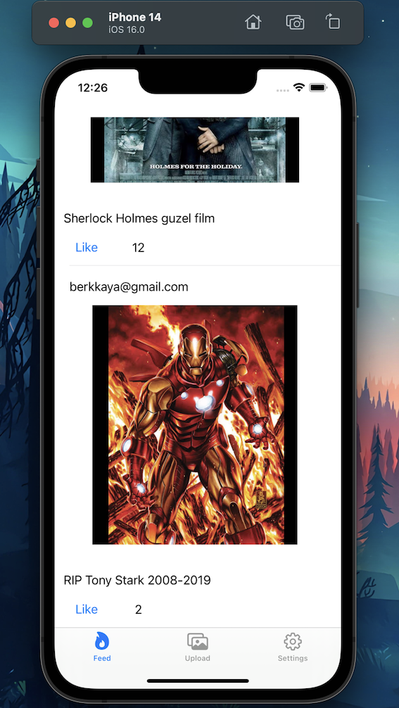

# InstagramClone

In this project, I used cocoapods to include firebase in the project, and I did firebase operations such as saving-editing the data and pulling the loaded data, and the instagram clone application appeared.

<h1>Some of the features I learned:</h1>

-Tab Bar

-Sign Up and Sign In to the Firebase (Auth)

-Adding data to the Firebase Store and Database

-Creating custom cell (prototype cell) to the tableView

-Pulling data from Firebase

-Data order

-Some functions (instagram like posts, adding photo in the phone lib etc).

Logout FireBase and App

Open Feeds directly once the user is Sign in to the app

